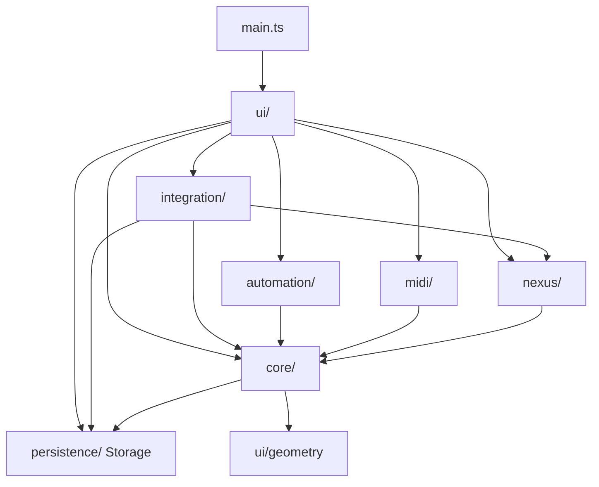
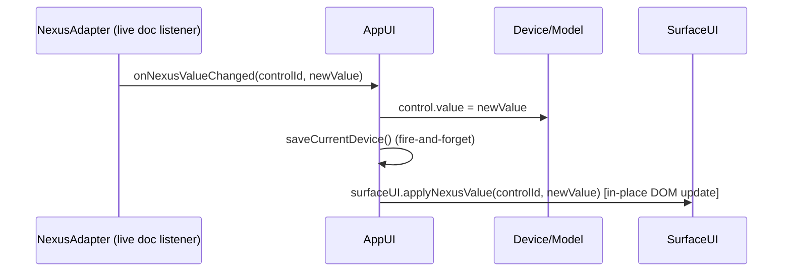
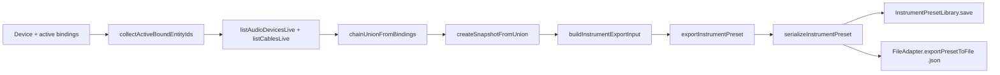

# Metatron — Architecture

> Configurable Controller and Macro Editor for Audiotool.
> Mutable Object Graph + Constructor Injection + Callback-DI. No UI framework,
> no state-management library, no event bus.

---

## 1. Overview

### Architecture philosophy

Metatron is a deliberately **framework-free TypeScript application**. All state
lives in a **mutable object graph** — a `Device` is a real object with real
`Control`, `Group` and `Preset` children that are mutated in place. UI
components receive their dependencies through **constructor injection**, and
all `UI → Core` communication flows upward through **plain function callbacks**
registered at construction time. The view layer is rebuilt on demand by
re-rendering the DOM (`render-by-rebuild`), while value-only changes update the
existing DOM in place.

### Why no framework?

- **The problem space is small.** A controller layout is at most 32 active
  controls (`Device.MAX_ACTIVE_CONTROLS = 32`), one canvas, and one connected
  Audiotool document. A virtual-DOM/diffing engine would add more complexity
  than it saves.
- **No reactive indirection.** With plain mutable models, "change a value"
  is a direct property write; the data flow is readable top-to-bottom without
  subscription semantics, memoization, or selector layers.
- **Guaranteed determinism.** Every render is a pure function of the current
  model state. Rebuilding the entire DOM from scratch can never go stale.

### Core principles

| Principle | Meaning |
| --- | --- |
| Mutable Object Graph | `DeviceLibrary.currentDevice` and everything under it is single, shared, mutable state — no per-component copies. |
| Constructor Injection | All dependencies are passed into constructors; nothing is fetched from globals, singletons, or DI containers. |
| Callback-DI | UI → Core communication uses function callbacks assigned at construction time (e.g. `onDeviceChanged`). |
| No events for app logic | No `CustomEvent`, no `EventEmitter`, no app-level pub/sub. Only **native DOM events** (pointer, keydown, input) exist. |
| Two-stage rendering | Structural changes → **full re-render**; value changes → **in-place DOM update**. |
| Fire-and-forget persistence | `localStorage` writes never block the UI; failures are logged, never thrown. |

---

## 2. Module Structure

```
src/
├── main.ts            Entry point; boots AppUI into #app.
├── core/              Pure domain: model, DeviceLibrary, BindingManager, history,
│                      instrument preset engines. No DOM, no SDK.
├── ui/                DOM UI layer: AppUI (orchestrator) + SurfaceUI + EditorUI +
│                      DeviceLibraryUI + Toast + writeRefusal + geometry constants.
├── nexus/             Audiotool Nexus bridge: NexusAdapter, live chain discovery,
│                      snapshot, clone, verify, planning, value mapping, learn.
├── midi/              Web MIDI: access, learn, mapping (channel/CC → control), scaling.
├── automation/        Gesture recording (Recorder) + automation writer to Nexus.
├── persistence/       localStorage library (Storage, InstrumentPresetLibrary) + FileAdapter.
└── integration/       Thin orchestration between core/nexus/persistence for workflows.
```

### Responsibilities

| Module | Responsibility | Owns / exports |
| --- | --- | --- |
| `core/` | Device model, layout invariants, undo history, preset model + import/export engines | `Device`, `Control`, `Preset`, `PresetMorph`, `DeviceLibrary`, `BindingManager`, `DeviceHistory`, `InstrumentPreset`, `InstrumentPresetExport`, `InstrumentPresetImport` |
| `nexus/` | Everything that talks to the Audiotool **live document** | `NexusAdapter`, `ChainSnapshot`, `ChainDiscovery`, `ChainLive`, `ChainClone`, `ChainVerify`, `ChainPlanning`, `NexusLearn`, `NexusValueMapping`, `ControlNaming` |
| `midi/` | Web MIDI hardware controllers | `MidiAccess`, `MidiMapping`, `MidiLearn`, `MidiScaling` |
| `automation/` | Records gestures, writes Audiotool automation | `AutomationRecorder`, `writeAutomationRecording`, `readTempoBpm` |
| `persistence/` | Local persistence + file bridge | `Storage` (`metatron_devices`), `InstrumentPresetLibrary` (`metatron_instrument_presets`), `FileAdapter` |
| `integration/` | Workflow orchestration (instrument presets, morph) | `InstrumentPresetIntegration`, `PresetMorphIntegration` |
| `ui/` | All DOM manipulation, no framework | `AppUI`, `SurfaceUI`, `EditorUI`, `DeviceLibraryUI`, `Toast`, `writeRefusal` |

### Dependency graph



Notes on the edges:

- **`integration → core/nexus/persistence`** is one-way: it *orchestrates* the
  proven engines and never contains business logic itself.
- **`core → ui/geometry`** is a deliberate exception: `Control`/`Device` import
  layout constants (`DEFAULT_CONTROL_SIZE`, `CURRENT_LAYOUT_VERSION`,
  `migratedGroupRect`) from `ui/geometry.ts` so the model and the renderer agree
  on geometry without duplicating constants.
- **`core → persistence/Storage`** exists because `DeviceLibrary` owns the
  device persistence; the Storage class itself is a thin, framework-free
  localStorage wrapper.
- **`ui` never depends on `automation` indirectly** — it wires the `Recorder`
  as a passive observer of the normal value path (see §5, Flow 1).

---

## 3. State Management

### Single source of truth

```
DeviceLibrary.currentDevice  ──►  Device
                                   ├─ controls: Map<id, Control>   (value, type, bindings)
                                   ├─ groups:   Map<id, Group>     (visual grouping)
                                   └─ presets:  Map<id, Preset>    (name + controlValues)
```

- One shared, live `Device` instance. `SurfaceUI`, `EditorUI`,
  `DeviceLibraryUI`, morph, MIDI and automation all read/write the *same*
  objects.
- `currentDevice` is switched by `DeviceLibrary.loadDevice()` / `createNewDevice()`
  and persisted to `localStorage` (`key: metatron_devices`) by `saveCurrentDevice()`.

### Constructor injection

`AppUI` receives all top-level collaborators through its constructor and passes
its own children theirs:

```typescript
new AppUI(
    root,                  // HTMLElement (#app)
    deviceLibrary,         // DeviceLibrary        (model + persistence)
    nexusAdapter,          // NexusAdapter         (Audiotool document)
    midiAccess,            // MidiAccess           (Web MIDI)
    bindingManager         // BindingManager | null → default device + fresh manager
);

// AppUI constructor then builds children with DI:
this.surfaceUI = new SurfaceUI(
    deviceLibrary, nexusAdapter, midiAccess, bindingManager, midiMapping,
    (controlId, value) => this.applyValueToDevice(controlId, value), // onLocalChange
    midiHandler,
    (controlId) => this.isWriteRefused(controlId)
);
```

There is exactly **one mutable graph** and no shared module-level state. Every
callback is a plain closure over the graph.

### No events for app logic

- App logic never uses `CustomEvent`, `EventEmitter`, or a pub/sub bus.
- The only `addEventListener` calls in the system are for **native** DOM events:
  `keydown` (undo/redo shortcuts, `AppUI.handleKeydown`), `input`, and pointer
  events inside the surface/editor canvases.
- Reasons: callbacks are type-checked at **compile time**, are greppable, and
  make control flow explicit — there is no symbolic name that could be misspelled.

### Prop-down / callback-up

- **Down:** state and services move down through constructors (props as
  injection).
- **Up:** child UI signals intent by invoking a stored callback
  (`onDeviceChanged`, `onPresetLoad`, `onLocalChange`). The callback's owner
  (`AppUI`) decides what happens.

---

## 4. Rendering Strategy

Two distinct render modes solve two different problems.

### Mode A — Full re-render (structural)

`AppUI.render()` (AppUI.ts:475) rebuilds the entire app shell:

```typescript
public render() {
    this.stopElapsedTimer();
    this.root.innerHTML = "";          // tear down the whole previous DOM
    // … rebuild toolbar, automation strip, sidebar, content area …
    if (this.currentMode === "EDIT") this.editorUI.render(contentArea);
    else                              this.surfaceUI.render(contentArea);
}
```

**Used for structural changes** — everything that changes the *shape* of the
UI:

- device switch / new device / device delete (`onDeviceChanged`)
- EDIT ↔ USE mode toggle
- undo / redo
- preset save / delete / instrument import / export
- automation arm / record / stop / apply / clear
- connect / disconnect status

**Cost control:** rebuilding is `O(number of DOM nodes)` for a few hundred
elements fixed by `MAX_ACTIVE_CONTROLS = 32`; structural changes are rare, so
the rebuild is cheap in practice. Transient DOM state that must survive a rebuild
is mirrored into runtime object fields first (e.g. `connectionUrl`).

### Mode B — In-place update (value)

`SurfaceUI.applyNexusValue()` (SurfaceUI.ts:101) updates the *existing* element
without touching the rest of the tree:

```typescript
public applyNexusValue(controlId: string, value: number) {
    const control = this.deviceLibrary.currentDevice?.getControl(controlId);
    if (!control || control.archived) return;
    control.value = value;
    this.updateControlElement(controlId, value);   // DOM property write only
}

private updateControlElement(controlId: string, value: number) {
    const el = this.container.querySelector(`[data-ctl-id="${controlId}"]`);
    const knob = el?.querySelector(".knob-indicator");
    if (knob) knob.style.transform = `rotate(${-135 + value * 270}deg)`;
    const sw = el?.querySelector(".switch-body");
    if (sw) sw.classList.toggle("on", value > 0.5);
}
```

**Used for value-only changes:**

- external Nexus push (remote Audiotool change)
- local gesture feedback during a drag
- MIDI CC input
- morph A/B live blend (`AppUI` passes `surfaceUI.applyNexusValue` to
  `DeviceLibraryUI`)
- write-refused visual marker (`setWriteRefused` toggles `.write-refused` + title)

**Why two modes and not one diffing engine:** value updates touch at most two
DOM properties per control and must feel instant (no rebinding during a pointer
drag). Structural updates are infrequent; paying a diffing tax to save a rebuild
that only costs a few hundred `createElement` calls is not worth it.

### Interaction guard: no loop-back

- A local gesture never re-enters its own path: `SurfaceUI` calls
  `onLocalChange` for the gesture and `AppUI.applyValueToDevice` performs the
  model write + **in-place** UI update + Nexus write.
- A Nexus push only sets `control.value` and calls `applyNexusValue` (UI-only);
  it never calls `updateBoundControl`, so remote changes can't echo back.

---

## 5. State Flows

### Flow 1 — Local gesture (drag a knob in USE mode)

```mermaid
sequenceDiagram
    participant S as SurfaceUI
    participant A as AppUI
    participant M as Device/Model
    participant L as Storage(localStorage)
    participant N as NexusAdapter
    S->>A: onLocalChange(controlId, value)
    A->>M: control.value = value
    A->>L: saveCurrentDevice()  (fire-and-forget)
    A->>S: surfaceUI.applyNexusValue(controlId, value)  [in-place DOM update]
    A->>A: recorder.capture(...)  (passive observer)
    A->>N: updateBoundControl(controlId, value)  → Promise<boolean>
    Note over N: refused/rejected → mark .write-refused;<br/>local value is KEPT
```

```typescript
// AppUI.applyValueToDevice (AppUI.ts:207) — the single local value path
control.value = value;
this.deviceLibrary.saveCurrentDevice();
this.surfaceUI.applyNexusValue(controlId, value);        // in-place, no re-render
this.recorder.capture(control.id, value, control.type);  // automation (observer)
this.nexusAdapter.updateBoundControl(controlId, value).then(
    (ok) => this.setWriteRefused(controlId, !ok),        // false → refused marker
    () => this.setWriteRefused(controlId, true),
);
```

`updateBoundControl` is **fire-and-forget** (`.then`, not `await`): the local
value always wins immediately, and a refused Nexus write only adds a visual
warning — the UI never blocks on Audiotool.

### Flow 2 — External Nexus push (parameter changed inside Audiotool)



```typescript
// AppUI constructor (AppUI.ts:111)
this.nexusAdapter.onNexusValueChanged = (controlId, newValue) => {
    const control = this.deviceLibrary.currentDevice?.getControl(controlId);
    if (!control) return;
    control.value = newValue;
    this.deviceLibrary.saveCurrentDevice();
    this.surfaceUI.applyNexusValue(controlId, newValue);
};
```

No full re-render, no Nexus re-write, no recorder capture (automation records
Metatron gestures only).

### Flow 3 — Structural change (loading a preset or switching device)

```mermaid
sequenceDiagram
    participant DL as DeviceLibraryUI
    participant A as AppUI
    participant B as BindingManager
    participant MM as MidiMapping
    participant R as AppUI.render
    DL->>A: onDeviceChanged()
    A->>B: bindingManager.setDevice(device)
    A->>MM: midiMapping.updateDevice(device)
    A->>R: render() → root.innerHTML = ""; rebuild toolbar+sidebar+content
```

```typescript
// AppUI.onDeviceChanged (AppUI.ts:452)
private onDeviceChanged() {
    const device = this.deviceLibrary.currentDevice;
    if (device) {
        this.bindingManager.setDevice(device);
        this.midiMapping.updateDevice(device);
    }
    this.render();   // structural → full re-render
}
```

---

## 6. Core Modules Deep-Dive

### `core/` — data model and domain logic

- **Model** (`model/`): `Device` (`controls`/`groups`/`presets` `Map`s,
  `MAX_ACTIVE_CONTROLS = 32`, `serialize`/`deserialize`), `Control`
  (`type: "knob" | "switch"`, `value`, `softDelete`/`archived`, bindings,
  `layoutVersion`), `Preset` (`controlValues`), `PresetMorph`
  (`morphControlValues` with quantized switch handling), `Group`.
- **`DeviceLibrary`**: current device lifecycle + persistence through `Storage`.
- **`BindingManager`**: maps a control → live Audiotool field
  (`getActiveBinding`, `activeBindingState: "CONNECTED" | "DISCONNECTED" | "UNCONFIGURED"`).
- **History** (`history/`): `DeviceHistory` (session-scoped undo/redo,
  `HISTORY_LIMIT = 100`, `recordDeviceAction`), built on
  `captureDeviceState`/`restoreDeviceState` patches.
- **Instrument presets** (`instrument/`): versioned `InstrumentPreset` envelope
  (`serializeInstrumentPreset`, `parseInstrumentPreset`, `validateInstrumentPreset`,
  `InstrumentPresetError`) plus the pure `InstrumentPresetExport` /
  `InstrumentPresetImport` engines.

### `nexus/` — Audiotool / Nexus integration

- **`NexusAdapter`** — the only place the live document is reached:
  `openProject(url, bindingManager)`, `isDocumentConnected()`,
  `onDocumentConnectedChanged(cb)`, `updateBoundControl(controlId, value) →
  Promise<boolean>`, and the inbound callback `onNexusValueChanged`.
- **Chain layer** — pure, testable snapshot/clone pipeline:
  `ChainDiscovery` (`chainUnionFromBindings`, `extractAudioConnections`),
  `ChainLive` (`listAudioDevicesLive`, `listCablesLive`), `ChainSnapshot`
  (`createSnapshotFromUnion`), `ChainClone` (`cloneChainFromSnapshot`),
  `ChainVerify`, `ChainPlanning`, `ChainCreatableTypes`, `ChainTypes`, `ChainPath`.
- **Mapping/learn** — `NexusValueMapping` (`createNexusValueMappingFromSchema`,
  `mapNexusToNormalized`), `NexusLearn` (`LearnTimeoutError`,
  `LearnCancelledError`), `ControlNaming`.

### `midi/` — Web MIDI integration

`MidiAccess` (device init + `setMessageHandler`), `MidiMapping`
(`getControlIdForMessage(channel, cc)`, `updateDevice(device)`),
`MidiLearn` (`MidiLearnTimeoutError`, `MidiLearnCancelError`), `MidiScaling`
(`applyMidiScaling(raw, definition)`). Incoming CC → mapped control →
`AppUI.applyValueToDevice` — the same path as a local gesture.

### `automation/` — automation recording

`AutomationRecorder` (states `IDLE | ARMED | RECORDING | STOPPED`,
`capture(controlId, value, type)` is a **passive observer** of the value path),
`writeAutomationRecording(recording, doc, bindingManager)` creates real
Audiotool automation tracks, `readTempoBpm` reads the project tempo into the
take. This module never writes control values itself.

### `integration/` — workflows over the engines

`InstrumentPresetIntegration` (export/import orchestration, root selection,
`buildInstrumentExportInput`, `loadAndParseInstrumentPreset`) and
`PresetMorphIntegration` (`applyMorphToDevice(device, presetA, presetB, amount,
sink)` — pure `morphControlValues` result applied to live controls, Nexus
writes delegated to an injected sink with NOOP fallback).

### `persistence/` — localStorage + file bridge

`Storage` (`metatron_devices`), `InstrumentPresetLibrary`
(`metatron_instrument_presets`: `save`/`get`/`list`/`delete`), and
`FileAdapter` — the browser File-API bridge (`exportPresetToFile`,
`importPresetFromFile`, `exportMultiplePresetsToFile`) that reuses the envelope
serialization instead of duplicating it.

### `ui/` — DOM-only UI

`AppUI` (orchestrator + render), `SurfaceUI` (USE-mode performance surface with
in-place value updates), `EditorUI` (EDIT-mode layout editor over the same
model), `DeviceLibraryUI` (sidebar: devices, presets, bindings, morph,
instrument presets), `Toast`, `writeRefusal`, `geometry`.

---

## 7. Data Flow: Instrument Preset Lifecycle

### Export



- Only **connected, bound controls** are exported (`getActiveBinding`).
- Values are validated (`0..1`), bindings are cross-checked against the
  snapshot device indices; failures are reported as `errors`, never silently
  dropped.
- The file path reuses the exact same `serializeInstrumentPreset` envelope —
  no second serialization format.

### Import

```
File (.json)  → FileAdapter.importPresetFromFile → parseInstrumentPreset
Library entry → loadAndParseInstrumentPreset      → parseInstrumentPreset
                                                     └─ validates → InstrumentPresetError
       │
       ▼
importInstrumentPreset(preset, targetDoc, bindingManager)
       ├─ cloneChainFromSnapshot(snapshot, targetDoc, {maxDepth})  → idMap
       ├─ write preset control values onto the cloned target controls
       └─ chainStructureOk(verification)  → success/failure report
```

The target document is the **connected project**. The `P2` gate in
`DeviceLibraryUI` (`confirmInstrumentImport`) requires explicit confirmation
before anything is cloned into the target.

### Chain clone (the engine behind import)

`SOURCE` (live connected project, read-only) → `chainUnionFromBindings` →
`createSnapshot` → `snapshot` → `cloneChainFromSnapshot(snapshot, targetDoc)`
→ target document mutated → `ChainVerify` structure check. No source ids enter
the envelope; only the snapshot, the bindings and the control values travel.

---

## 8. Error Handling

### Custom error classes

| Error | Location | Raised by |
| --- | --- | --- |
| `InstrumentPresetError` | `core/instrument/InstrumentPreset.ts:62` | `parseInstrumentPreset` / `validateInstrumentPreset` (invalid JSON, schema violations) |
| `LearnTimeoutError` | `nexus/NexusLearn.ts:43` | Nexus learn with no live change within the window |
| `LearnCancelledError` | `nexus/NexusLearn.ts:51` | Nexus learn cancelled by the user |
| `MidiLearnTimeoutError` | `midi/MidiLearn.ts:12` | MIDI learn timed out |
| `MidiLearnCancelError` | `midi/MidiLearn.ts:4` | MIDI learn cancelled |

### Propagation strategy

- **Engines throw** rich, typed errors (`InstrumentPresetError`).
- **Orchestration catches and converts** to report shapes:
  `{ ok: true, … } | { ok: false, errors: string[] }`. Examples:
  `loadAndParseInstrumentPreset` wraps parse failures in `{ ok: false, errors }`;
  `importPresetFromFile` rejects with the wrapped `Error("File read failed")`
  for FileReader failures and propagates `InstrumentPresetError` unchanged.
- **UI reports** through `Toast` and per-action result views
  (`renderInstrumentExportOutcome`, `renderInstrumentImportOutcome`).
- **Learn/midi state machines** surface timeouts/cancels to the user via toast
  and learning bars.

### Write-refusal handling (Audiotool rejects a write)

The Nexus write is a `Promise<boolean>` — resolved `false` when the document
refused the value (disconnected/immutable/unbound/unsupported), rejected on a
real error.

```typescript
this.nexusAdapter.updateBoundControl(controlId, value).then(
    (ok) => this.setWriteRefused(controlId, !ok),   // false → refused
    () => this.setWriteRefused(controlId, true),
);
```

- The **local value is always kept** — a refused write never rolls back the UI.
- The control element gets `class="write-refused"` + title
  *"Audiotool did not accept this value."* (`writeRefusal.ts`).
- A console warning/error is emitted for diagnostics; no queueing, no retry.

### Fire-and-forget persistence

`Storage.saveDevice` wraps `localStorage.setItem` in `try/catch` and only logs
(`console.error`). Quota exceeded or "Data not available" never throw into the
UI flow — the app keeps working in memory.

---

## 9. Testing Strategy

| Layer | Environment | Covers |
| --- | --- | --- |
| Unit (core/nexus/midi/integration) | Node (default) | Pure logic: model, serialization, snapshot/clone, value mapping, preset engines, morph. |
| Integration (workflows) | Node | Chain discovery/clone, instrument preset import/export pipelines, history/undo. |
| UI | `happy-dom` (per-file `@vitest-environment happy-dom`) | Rendering, surface/editor behaviour, toast, library flows, file bridge. |
| Architecture | Node | Dependency direction, boundary tests, invariant regression (e.g. grid visibility). |
| PoC | Node | The original proof-of-concept reports still execute as regression tests. |

- **837 tests across 74 files, all passing.** Test files mirror `src/` under
  `tests/` (e.g. `tests/core/…`, `tests/ui/…`, `tests/persistence/…`).
- Run everything: `npm test` (Vitest). Single file/watch as needed:

```bash
npm test
npx vitest run tests/ui/GridVisibility.test.ts
npx vitest watch tests/persistence
```

- Static type check: `npm run build` runs `tsc` first; `npx tsc --noEmit` for a
  check-only run. `noUnusedLocals`/`noUnusedParameters` are enforced.

---

## 10. Design Decisions & Trade-offs

| Decision | Why | Accepted trade-off |
| --- | --- | --- |
| **Mutable object graph, not immutable** | Direct property writes are the simplest possible model for a small controller app; matches how the DOM and the live Nexus document already behave. | No structural sharing / free undo. Mitigated by `DeviceHistory` capturing patches **at action boundaries** (`captureDeviceState`/`restoreDeviceState`), not per keystroke. |
| **Callback-DI, not EventEmitter** | Callbacks are compile-time checked, greppable, and make the call graph explicit; no string event names, no global bus, no subscription leaks. | Slightly more boilerplate at the wiring site (`AppUI` constructor). |
| **Full re-render, not Virtual DOM** | Rendering is a pure function of state; rebuild cost is bounded and small (≤32 controls). No framework dependency to version. | Any transient DOM state (scroll, input value, timers) is lost on rebuild — mitigated by runtime mirrors (`connectionUrl`) and timer teardown (`stopElapsedTimer`). |
| **Fire-and-forget persistence** | localStorage writes are fast; the UI never waits on I/O; write failures are non-fatal. | A crash in the same tick as a failed write can lose the last values — acceptable for a session-scoped client tool. |
| **Write-refusal visible, not blocking** | The local value always wins; Audiotool being disconnected shouldn't freeze the controller. | A refused value is silently ignored on the Audiotool side until the user reconnects (clearly marked in the UI). |
| **No reactive framework** | See §1 — the problem space doesn't need one, and removing it removes the largest external coupling. | All re-render triggers must be called manually at the right point in the flow (single orchestrator: `AppUI`). |

### Known risks (accepted)

- A full re-render is scheduled for every `onDeviceChanged`; if devices ever grow
  past hundreds of controls, hot-path value updates must move to Mode-B only.
- `core → ui/geometry` violates strict layering by one edge; it keeps geometry
  single-sourced at the cost of a core→ui import.
- Undo is device-scoped and session-scoped by design (`DeviceHistory` is
  transient, `HISTORY_LIMIT = 100`) — it intentionally does not persist.

---

## 11. Extension Points

### Add a new control type (e.g. `"slider"`)

1. **Model:** extend the `ControlType` union in `core/model/types.ts`
   (`export type ControlType = "knob" | "switch";`).
2. **Geometry:** give it a sane default in `ui/geometry.ts`
   (`DEFAULT_CONTROL_SIZE`) so legacy migration and the editor stay consistent.
3. **Surface rendering:** add a branch in `SurfaceUI.renderControl` for the new
   type and teach `SurfaceUI.updateControlElement` how to reflect a value
   in-place (the Mode-B path already keys on `[data-ctl-id]`).
4. **Editor:** add the matching visual/affordances in `EditorUI` if the type
   introduces editor-only behaviours.
5. **Mapping/morph:** if the control is discrete, extend
   `PresetMorph.quantize`/`morphControlValues` (it already takes
   `controlTypes: Readonly<Record<string, ControlType>>`) and reuse
   `PresetMorphIntegration`.
6. **Tests:** extend the model, surface, and editor test suites — the type union
   change immediately flags any switch that forgot the new branch.

### Add a new Nexus feature (e.g. a live parameter endpoint)

1. Put the pure logic in `nexus/` (mirror `ChainSnapshot`/`ChainLive`).
2. Expose the live part through `NexusAdapter` (mirror `updateBoundControl`) —
   keep the *SDK calls or domain calls inside `NexusAdapter`*, pure mappers
   outside.
3. If the feature is reactive (remote change → UI), add a plain callback
   property next to `onNexusValueChanged` and wire it in `AppUI`'s constructor.
4. Prove it in a `tests/nexus/` spec before touching the UI.

### Extend the UI

1. Create a component in `ui/` with **constructor injection**: pass the model
   and any callbacks it needs (see `DeviceLibraryUI`, `SurfaceUI`).
2. Mount it inside the relevant render path of `AppUI.render()` (toolbar,
   automation bar, sidebar, or content area).
3. Follow the two-stage rule:
   - structural change → call the `onDeviceChanged`-style callback (owner re-renders), or call `this.render()` on `AppUI`;
   - value-only change → expose an in-place update method (like
     `SurfaceUI.applyNexusValue`) and call it directly — never trigger a full
     re-render for a value.
4. New UI must keep using `Toast` for transient messages and the callback-DI
   pattern; **no** global state or event bus.

---

*Metatron — Configurable Controller and Macro Editor for Audiotool.*